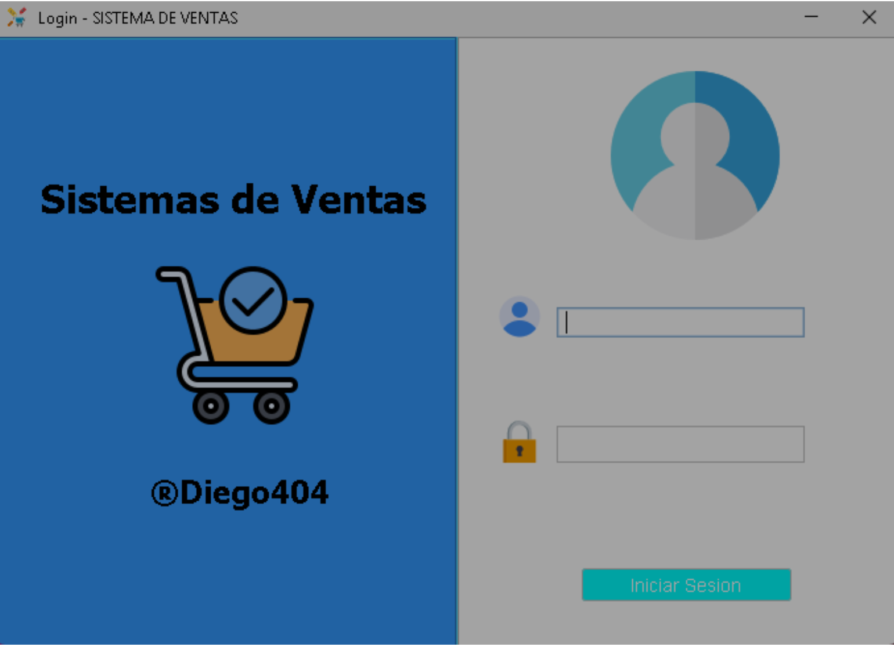
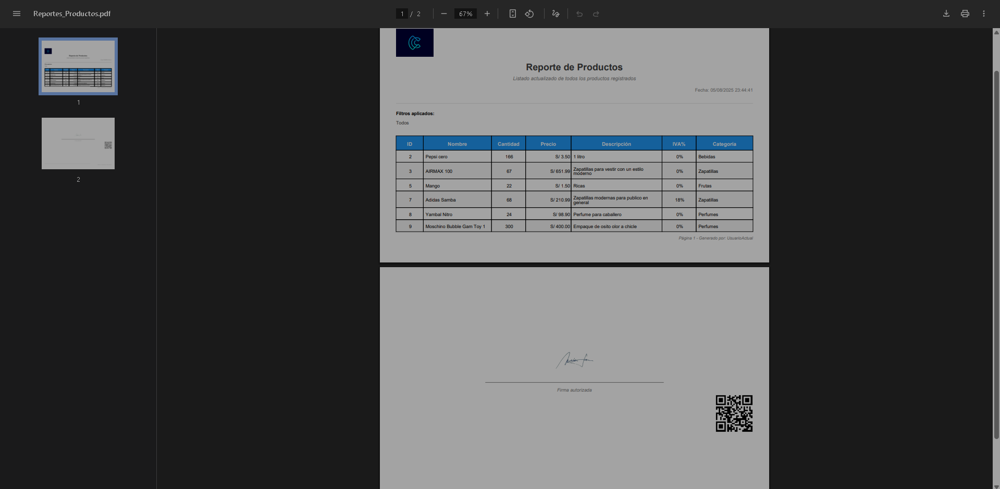
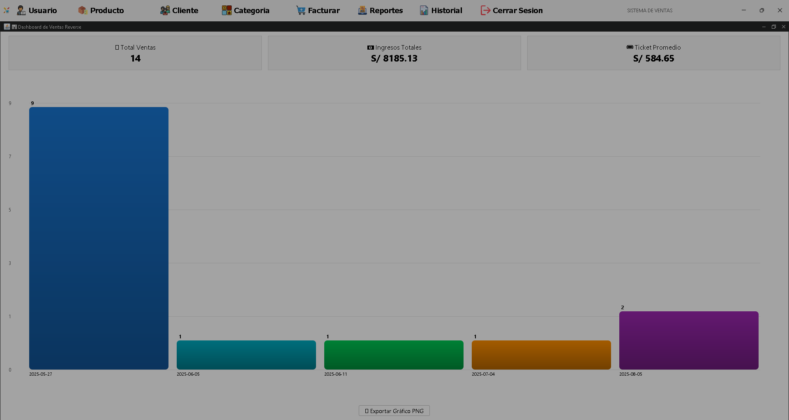

# 🛒 Sales System - Java Desktop Application


<p align="center">
  
  
  
  
</p>

<p align="center">
  <strong>Comprehensive sales management system with enterprise architecture</strong><br/>
  Developed with design patterns, database connectivity, and professional report generation
</p>

---

## 🚀 Main Features

<table>
<tr>
<td width="50%">

### 💼 **Business Management**
- ✅ Complete inventory control
- ✅ Customer and supplier registration
- ✅ Real-time sales processing
- ✅ Detailed transaction history

</td>
<td width="50%">

### 🏗️ **Robust Architecture**
- ✅ Factory pattern for DAOs
- ✅ Observer for dynamic updates
- ✅ Multi-layer architecture (MVC)
- ✅ Validations and error handling

</td>
</tr>
</table>

---

## 🖼️ System Screenshots

<div align="center">

### 🔑 Login Screen


### Main Interface


### Sales Module


### PDF Reports


### 📊 Dashboard (Main Panel)


</div>

---

## 🛠️ Technology Stack

<div align="center">

| Technology | Version | Purpose |
|:----------:|:-------:|:---------:|
|  | 17 LTS | Business logic and GUI |
|  | 8.0 | Relational database |
|  | Latest | Database connectivity |
|  | 6.x | Report generation |
|  | Built-in | Graphical interface |
|  | 1.4 | Date selection in panels |

</div>

---

## 📁 Project Architecture

```
📦 Sistema-de-Ventas/
├── 📂 src/
│   ├── 📂 DAO/                    # Data Access Objects
│   │   ├── ClienteDAO.java
│   │   ├── ProductoDAO.java
│   │   └── VentaDAO.java
│   ├── 📂 Factory/                # Factory Pattern Implementation
│   │   └── DAOFactory.java
│   ├── 📂 Observador/             # Observer Pattern
│   │   ├── Observable.java
│   │   └── Observer.java
│   ├── 📂 Servicio/               # Business Logic Layer
│   │   ├── ClienteServicio.java
│   │   ├── ProductoServicio.java
│   │   └── VentaServicio.java
│   ├── 📂 modelo/                 # Entity Classes
│   │   ├── Cliente.java
│   │   ├── Producto.java
│   │   └── Venta.java
│   ├── 📂 vista/                  # GUI Components
│   │   ├── MainFrame.java
│   │   ├── VentasPanel.java
│   │   └── ReportesPanel.java
│   ├── 📂 conexion/               # Database Connection
│   │   └── ConexionBD.java
│   ├── 📂 Reportes/               # Report Templates
│   │   └── VentasReport.jrxml
│   └── 📂 pdf/                    # PDF Generation
│       └── GeneradorPDF.java
├── 📂 lib/                        # External Libraries
├── 📂 img/                        # UI Resources
├── 📂 docs/                       # Documentation
├── 📄 build.xml                   # Ant Build File
└── 📄 README.md
```

---

## ⚡ Implemented Features

### 🏪 **Sales Management**
- Interactive shopping cart
- Automatic calculation of totals and taxes
- Application of discounts and promotions
- Receipt generation

### 👥 **Customer Administration**
- Complete information registration
- Advanced search with filters
- Purchase history per customer
- Contact data management

### 📦 **Inventory Control**
- Real-time stock management
- Low inventory alerts
- Product categorization
- Price and cost control

### 📊 **Reports and Analytics**
- Daily/monthly sales reports
- Best-selling products analysis
- Professional PDF export
- Performance charts

---

## 🚀 Installation and Configuration

### Prerequisites

```bash
☕ Java 17 or higher
🛢️ MySQL 8.0+
📦 Apache Ant (optional)
```

### Installation Steps

1. **Clone the repository**
```bash
git clone https://github.com/Reverse07/Sistema-de-Ventas.git
cd Sistema-de-Ventas
```

2. **Configure database**
```bash
# Create database
mysql -u root -p
CREATE DATABASE sistema_ventas;

# Import structure (if SQL file exists)
mysql -u root -p sistema_ventas < database/schema.sql
```

3. **Configure connection**
Edit `src/conexion/ConexionBD.java`:
```java
private static final String URL = "jdbc:mysql://localhost:3306/sistema_ventas";
private static final String USER = "your_username";
private static final String PASSWORD = "your_password";
```

4. **Compile and run**
```bash
# Using Ant
ant compile
ant run

# Or directly with Java
javac -cp "lib/*:src" src/**/*.java
java -cp "lib/*:src" vista.MainFrame
```

---

## 🎯 Implemented Design Patterns

### 🏭 **Factory Pattern**
```java
// Abstracts the creation of specific DAOs
DAOFactory factory = DAOFactory.getInstance();
ClienteDAO clienteDAO = factory.getClienteDAO();
```

### 👀 **Observer Pattern**
```java
// Automatic notification of UI changes
public class VentasPanel implements Observer {
    @Override
    public void update(Observable o, Object arg) {
        actualizarTablaVentas();
    }
}
```

### 🏗️ **MVC Architecture**
- **Model**: Entities and data logic
- **View**: Swing interfaces
- **Controller**: Business services

---

## 📈 Project Metrics

<div align="center">


</div>

---

## 🤝 Contributions

Contributions are welcome. To contribute:

1. Fork the project
2. Create a feature branch (`git checkout -b feature/AmazingFeature`)
3. Commit your changes (`git commit -m 'Add some AmazingFeature'`)
4. Push to the branch (`git push origin feature/AmazingFeature`)
5. Open a Pull Request

---

## 📝 License

This project is under the MIT License. See `LICENSE` for more details.

---

## 📞 Contact and Support

<div align="center">

**Diego Arroyo**

*Full Stack Developer | Systems Engineering Student*

[](mailto:tmldiego7@gmail.com)
[](https://linkedin.com/in/diego-arroyo)
[](https://github.com/Reverse07)

</div>

---

## 🌟 Did you like the project?

If this project was useful to you, consider giving it a ⭐ on GitHub!

<div align="center">

**Developed with ❤️ for efficient business management**


</div>
