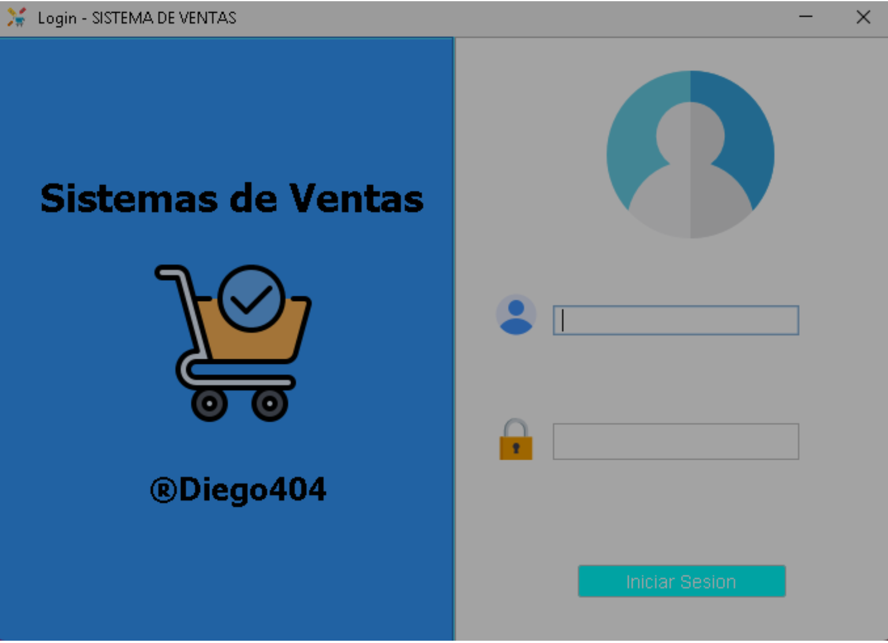
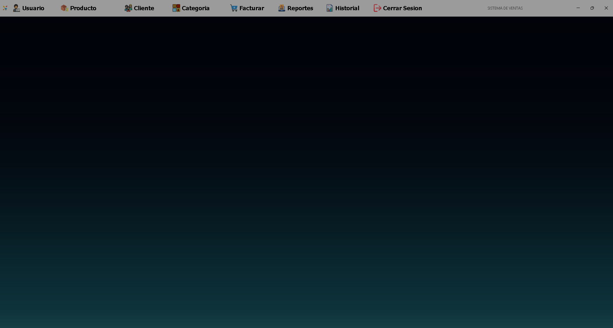
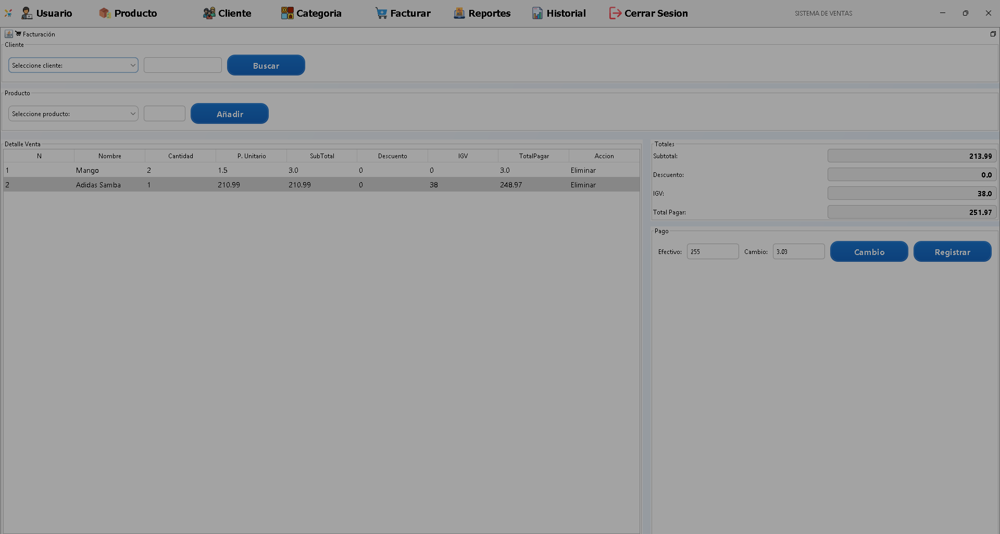
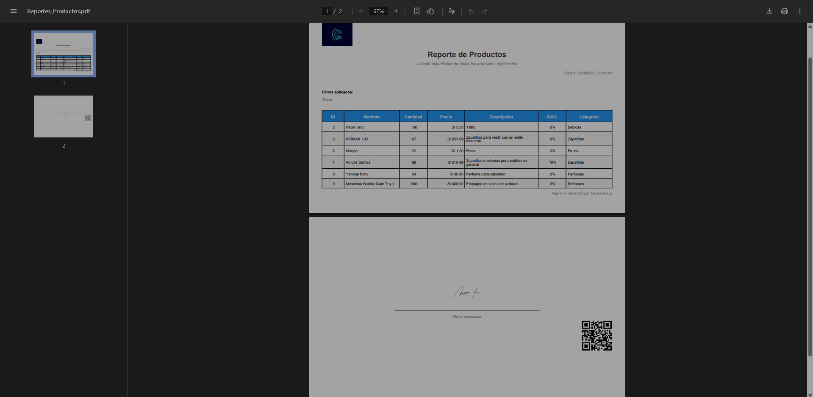
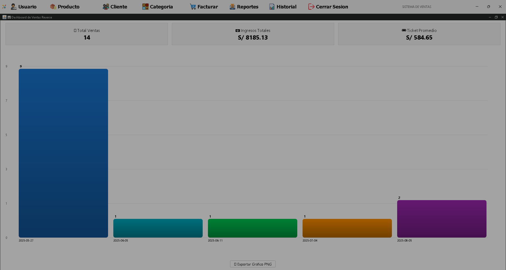

# 🛒 Sistema de Ventas - Java Desktop Application


<p align="center">
  
  
  
  
</p>

<p align="center">
  <strong>Sistema integral de gestión de ventas con arquitectura empresarial</strong><br/>
  Desarrollado con patrones de diseño, conexión a base de datos y generación de reportes profesionales
</p>

---

## 🚀 Características Principales

<table>
<tr>
<td width="50%">

### 💼 **Gestión Empresarial**
- ✅ Control completo de inventario
- ✅ Registro de clientes y proveedores
- ✅ Procesamiento de ventas en tiempo real
- ✅ Historial detallado de transacciones

</td>
<td width="50%">

### 🏗️ **Arquitectura Robusta**
- ✅ Patrón Factory para DAOs
- ✅ Observer para actualizaciones dinámicas
- ✅ Arquitectura multicapa (MVC)
- ✅ Validaciones y manejo de errores

</td>
</tr>
</table>

---

## 🖼️ Capturas del Sistema

<div align="center">

### 🔑 Pantalla de Login


### Interfaz Principal


### Módulo de Ventas


### Reportes PDF


### 📊 Dashboard (Panel Principal)


</div>

---

## 🛠️ Stack Tecnológico

<div align="center">

| Tecnología | Versión | Propósito |
|:----------:|:-------:|:---------:|
|  | 17 LTS | Lógica de negocio y GUI |
|  | 8.0 | Base de datos relacional |
|  | Latest | Conectividad BD |
|  | 6.x | Generación de reportes |
|  | Built-in | Interfaz gráfica |
|  | 1.4 | Selección de fechas en paneles |

</div>
---

## 📁 Arquitectura del Proyecto

```
📦 Sistema-de-Ventas/
├── 📂 src/
│   ├── 📂 DAO/              # Data Access Objects
│   │   ├── ClienteDAO.java
│   │   ├── ProductoDAO.java
│   │   └── VentaDAO.java
│   ├── 📂 Factory/          # Factory Pattern Implementation
│   │   └── DAOFactory.java
│   ├── 📂 Observador/       # Observer Pattern
│   │   ├── Observable.java
│   │   └── Observer.java
│   ├── 📂 Servicio/         # Business Logic Layer
│   │   ├── ClienteServicio.java
│   │   ├── ProductoServicio.java
│   │   └── VentaServicio.java
│   ├── 📂 modelo/           # Entity Classes
│   │   ├── Cliente.java
│   │   ├── Producto.java
│   │   └── Venta.java
│   ├── 📂 vista/            # GUI Components
│   │   ├── MainFrame.java
│   │   ├── VentasPanel.java
│   │   └── ReportesPanel.java
│   ├── 📂 conexion/         # Database Connection
│   │   └── ConexionBD.java
│   ├── 📂 Reportes/         # Report Templates
│   │   └── VentasReport.jrxml
│   └── 📂 pdf/              # PDF Generation
│       └── GeneradorPDF.java
├── 📂 lib/                  # External Libraries
├── 📂 img/                  # UI Resources
├── 📂 docs/                 # Documentation
├── 📄 build.xml             # Ant Build File
└── 📄 README.md
```

---

## ⚡ Funcionalidades Implementadas

### 🏪 **Gestión de Ventas**
- Carrito de compras interactivo
- Cálculo automático de totales e impuestos
- Aplicación de descuentos y promociones
- Generación de comprobantes

### 👥 **Administración de Clientes**
- Registro completo de información
- Búsqueda avanzada con filtros
- Historial de compras por cliente
- Gestión de datos de contacto

### 📦 **Control de Inventario**
- Gestión de stock en tiempo real
- Alertas de inventario bajo
- Categorización de productos
- Control de precios y costos

### 📊 **Reportes y Analytics**
- Reportes de ventas diarias/mensuales
- Análisis de productos más vendidos
- Exportación a PDF profesional
- Gráficos de rendimiento

---

## 🚀 Instalación y Configuración

### Prerrequisitos
```bash
☕ Java 17 o superior
🛢️ MySQL 8.0+
📦 Apache Ant (opcional)
```

### Pasos de Instalación

1. **Clonar el repositorio**
   ```bash
   git clone https://github.com/Reverse07/Sistema-de-Ventas.git
   cd Sistema-de-Ventas
   ```

2. **Configurar base de datos**
   ```bash
   # Crear base de datos
   mysql -u root -p
   CREATE DATABASE sistema_ventas;
   
   # Importar estructura (si existe archivo SQL)
   mysql -u root -p sistema_ventas < database/schema.sql
   ```

3. **Configurar conexión**
   Editar `src/conexion/ConexionBD.java`:
   ```java
   private static final String URL = "jdbc:mysql://localhost:3306/sistema_ventas";
   private static final String USER = "tu_usuario";
   private static final String PASSWORD = "tu_contraseña";
   ```

4. **Compilar y ejecutar**
   ```bash
   # Usando Ant
   ant compile
   ant run
   
   # O directamente con Java
   javac -cp "lib/*:src" src/**/*.java
   java -cp "lib/*:src" vista.MainFrame
   ```

---

## 🎯 Patrones de Diseño Implementados

### 🏭 **Factory Pattern**
```java
// Abstrae la creación de DAOs específicos
DAOFactory factory = DAOFactory.getInstance();
ClienteDAO clienteDAO = factory.getClienteDAO();
```

### 👀 **Observer Pattern**
```java
// Notificación automática de cambios en la UI
public class VentasPanel implements Observer {
    @Override
    public void update(Observable o, Object arg) {
        actualizarTablaVentas();
    }
}
```

### 🏗️ **MVC Architecture**
- **Modelo**: Entidades y lógica de datos
- **Vista**: Interfaces Swing
- **Controlador**: Servicios de negocio

---

## 📈 Métricas del Proyecto

<div align="center">


</div>

---

## 🤝 Contribuciones

Las contribuciones son bienvenidas. Para contribuir:

1. Fork el proyecto
2. Crear una rama para tu feature (`git checkout -b feature/AmazingFeature`)
3. Commit tus cambios (`git commit -m 'Add some AmazingFeature'`)
4. Push a la rama (`git push origin feature/AmazingFeature`)
5. Abrir un Pull Request

---

## 📝 Licencia

Este proyecto está bajo la Licencia MIT. Ver `LICENSE` para más detalles.

---

## 📞 Contacto y Soporte

<div align="center">

**Diego Arroyo**  
*Desarrollador Full Stack | Estudiante de Ingeniería de Sistemas*

[](mailto:tmldiego7@gmail.com)
[](https://linkedin.com/in/diego-arroyo)
[](https://github.com/Reverse07)

</div>

---

## 🌟 ¿Te gustó el proyecto?

Si este proyecto te fue útil, ¡considera darle una ⭐ en GitHub!

<div align="center">

**Desarrollado con ❤️ para la gestión empresarial eficiente**


</div>
